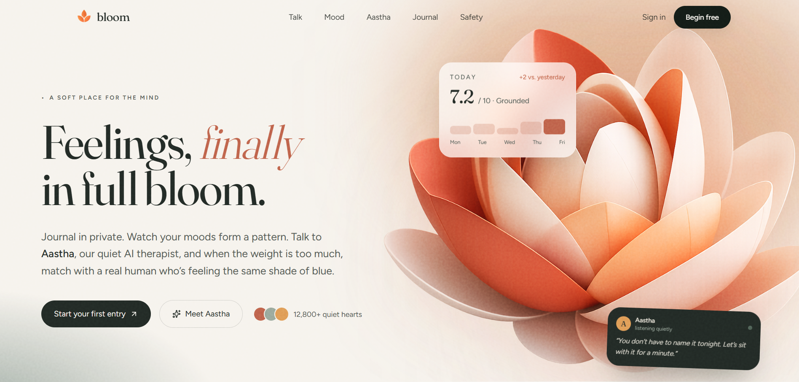

# Bloom

**Bloom** matches 100+ users into anonymous peer video calls by emotional state — anxious talks to anxious, calm to calm. Not random. Not an AI. Someone in the same moment.

Also: streaming AI therapist, private journaling, mood tracking.

**How does same-emotion matching work? →** [Queue Orchestration](#queue-orchestration)



## Queue Orchestration

```
User takes quiz
        │
        ▼
 Emotion assigned
        │
        ▼
 Redis Queue Manager
 ┌──────────────────────────┐◄───────────────────────┐
 │ Happy Queue              │                        │
 │ Calm Queue               │                        │
 │ Stressed Queue           │                        │
 │ Anxious Queue            │                        │
 └──────────────────────────┘                        │
        │                                            │
 Same emotion available?                             │
      /     \                                        │
    Yes      No                                      │
     │        │                                      │
     ▼        ▼                                      │
  Match   Cross-emotion queue                        │
     │        │                                      │
     └────────┘                                      │
          │                                          │
 Previous partner < 4s? → skip, retry               │
          │                                          │
          ▼                                          │
   Room allocated                                    │
          │                                          │
       Socket.IO                                     │
          │                                          │
       Zego Video                                    │
          │                                          │
        Skip?                                        │
       /     \                                       │
     Yes      No → session ends                      │
      │                                              │
  Cooldown · rematch block                           │
  Both requeued ─────────────────────────────────────┘
```

## Architecture Highlights

- Emotion-aware Redis queue orchestration with four primary queues and automatic cross-emotion fallback.
- Previous-peer exclusion to prevent rematching within a 4-second window.
- Skip cooldowns and report-aware matchmaking without duplicate room allocation.
- Standalone Socket.IO service decoupled from the Next.js application.
- SSE-based AI therapist with per-session conversational memory.
- Shared PostgreSQL data model across independent realtime and web services.

For the full design document see **[SYSTEM-DESIGN.md](SYSTEM-DESIGN.md)**.

---

## Features

- **Emotional check-in** — 10-question quiz scores mood 0–50, maps to one of four emotion tags (`happy` / `calm` / `stressed` / `anxious`).
- **Aastha, AI therapist** — streaming chat powered by Gemini 2.5 Flash, grounded in the user's current emotional state and last 10 messages.
- **Talk** — anonymous 1:1 peer video, emotion-matched, with skip, report, and auto-blocking.
- **Journal** — private free-text entries with full CRUD.
- **Mood tracking** — daily logs visualized as a history chart.
- **Auth** — email/password + Google OAuth, rate-limited API routes via Upstash Redis.

---

## System Architecture

Two independent services that share only a Postgres user ID:

```
                        ┌─────────────────────────────────────┐
                        │           Browser                   │
                        └──────┬──────────────┬──────────────┘
                               │              │
                    HTTP/SSE   │              │  WebSocket
                               ▼              ▼
              ┌────────────────────┐   ┌──────────────────────┐
              │   Next.js · Vercel │   │ Socket.IO · Render   │
              │                    │   │                      │
              │  auth · API routes │   │  emotion queues      │
              │  AI chat proxy     │   │  match + room mgmt   │
              │  journals · mood   │   │  skip · cooldowns    │
              └──────┬─────────────┘   └──────────┬───────────┘
                     │                            │
              Prisma │                   REST     │
                     ▼                            ▼
              ┌──────────────┐         ┌──────────────────────┐
              │  PostgreSQL  │         │    Upstash Redis      │
              │              │         │                      │
              │  users       │         │  queue:happy         │
              │  sessions    │         │  queue:calm          │
              │  journals    │         │  queue:stressed      │
              │  AI history  │         │  queue:anxious       │
              │  reports     │         │  skip-cooldown:{id}  │
              └──────────────┘         └──────────────────────┘
```

## Tech Stack

**Web app (`web/`)**
- [Next.js 16](https://nextjs.org) (App Router) + React 19, TypeScript
- [Tailwind CSS v4](https://tailwindcss.com) + [shadcn/ui](https://ui.shadcn.com) + [Framer Motion](https://www.framer.com/motion/)
- [better-auth](https://www.better-auth.com) (email/password + Google OAuth, email verification)
- [Prisma 7](https://www.prisma.io) + PostgreSQL
- [@google/genai](https://www.npmjs.com/package/@google/genai) - Gemini 2.5 Flash, SSE streaming
- [ZegoCloud UIKit Prebuilt](https://www.zegocloud.com) - video rooms
- [TanStack Query](https://tanstack.com/query), [react-hook-form](https://react-hook-form.com) + [Zod](https://zod.dev), [Recharts](https://recharts.org), [Resend](https://resend.com)

**Realtime server (`realtime/`)**
- [Express 5](https://expressjs.com) + [Socket.IO](https://socket.io)
- [Upstash Redis](https://upstash.com) - emotion queues, skip cooldowns, and web API rate limiting
- TypeScript via [tsx](https://github.com/privatenumber/tsx)


## Getting Started

### Prerequisites
- Node.js 20+
- A PostgreSQL database
- An [Upstash Redis](https://upstash.com) instance
- API credentials for: Google OAuth, Gemini, Resend, ZegoCloud

### 1. Clone & install
```bash
git clone https://github.com/<your-username>/bloom-v2.git
cd bloom-v2

cd web && npm install
cd ../realtime && npm install
```

### 2. Configure environment
Copy the example env files and fill in your own values:
```bash
cp web/.env.example web/.env
cp realtime/.env.example realtime/.env
```
See [Environment variables](#environment-variables) below for what each key is.

### 3. Set up the database (from `web/`)
```bash
cd web
npx prisma generate      # generate the Prisma client
npx prisma migrate dev   # apply migrations
```

### 4. Run both services
Bloom needs **both** processes running. In two terminals:
```bash
# Terminal 1 - web app
cd web && npm run dev        # http://localhost:3000

# Terminal 2 - realtime server
cd realtime && npm run dev   # http://localhost:4000
```
Open **http://localhost:3000**.

## Scripts

**web/**
| Command | Description |
|---------|-------------|
| `npm run dev` | Start the Next.js dev server on :3000 |
| `npm run build` | Production build |
| `npm run start` | Run the production build |
| `npm run lint` | Lint with ESLint |
| `npx prisma studio` | Browse the database in a GUI |
| `npx prisma migrate dev` | Create & apply a migration |

**realtime/**
| Command | Description |
|---------|-------------|
| `npm run dev` | Start the Socket.IO server on :4000 (`tsx src/index.ts`) |

## Environment variables

**web/**
| Key | Description |
|-----|-------------|
| `DATABASE_URL` | PostgreSQL connection string |
| `BETTER_AUTH_URL` | Base URL of the app (e.g. `http://localhost:3000`) |
| `BETTER_AUTH_SECRET` | Secret for signing sessions |
| `GOOGLE_CLIENT_ID` / `GOOGLE_CLIENT_SECRET` | Google OAuth credentials |
| `RESEND_API_KEY` | Resend API key for transactional email |
| `EMAIL_FROM` | "From" address for emails (e.g. `Bloom <noreply@yourdomain.com>`) |
| `GEMINI_API_KEY` | Google Gemini API key |
| `NEXT_PUBLIC_ZEGO_APP_ID` | ZegoCloud app ID (public, used client-side) |
| `ZEGO_SERVER_SECRET` | ZegoCloud server secret (server-side only; signs Talk tokens) |
| `UPSTASH_REDIS_REST_URL` / `UPSTASH_REDIS_REST_TOKEN` | Upstash Redis - powers API rate limiting (reuse the realtime instance). If unset, rate limiting is disabled. |

**realtime/**
| Key | Description |
|-----|-------------|
| `UPSTASH_REDIS_REST_URL` / `UPSTASH_REDIS_REST_TOKEN` | Upstash Redis credentials |
| `PORT` | Optional, defaults to `4000` |

> Never commit your real `.env` files. Only the keys-only `.env.example` templates belong in git.

## Project structure

```
bloom-v2/
├── web/                    # Next.js app
│   ├── app/                # routes, pages, API routes (app/api/*)
│   ├── components/         # shared + shadcn/ui components
│   ├── hooks/              # e.g. useStreamingChat
│   ├── lib/                # auth, prisma, socket clients
│   ├── prisma/             # schema + migrations
│   ├── server/             # server actions
│   └── utils/              # emotion scoring, helpers
├── realtime/               # Socket.IO matchmaking server
│   └── src/
│       ├── index.ts        # Express + Socket.IO entry
│       └── managers/       # matchManager, roomManager
└── ARCHITECTURE.md         # deep dive into the system design
```

## License

This project is currently shared for portfolio and educational purposes. All rights reserved unless a `LICENSE` file is added.

---

<sub>Bloom is a personal/portfolio project and is **not a substitute for professional mental-health care**. If you are in crisis, please contact a local emergency line or a qualified professional.</sub>
